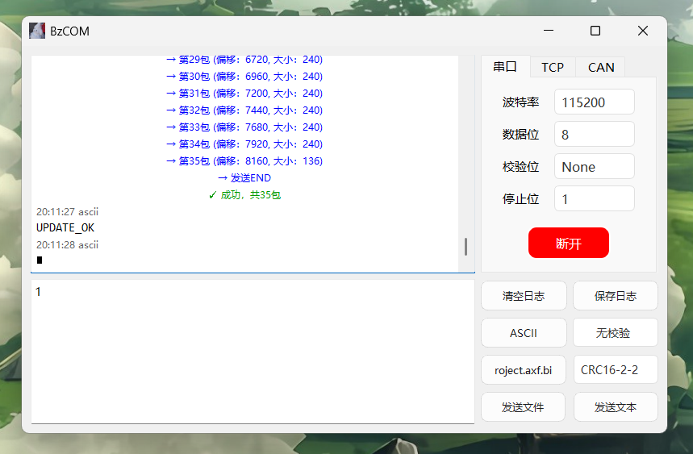
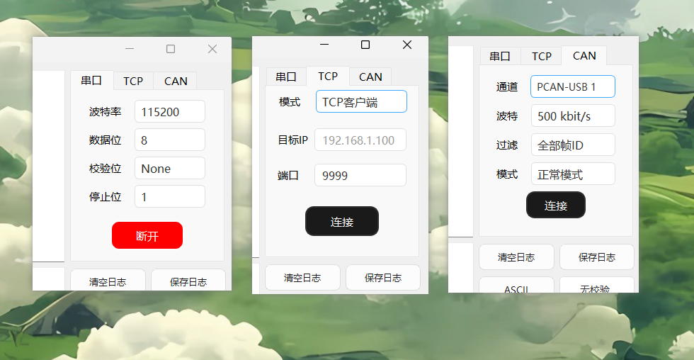
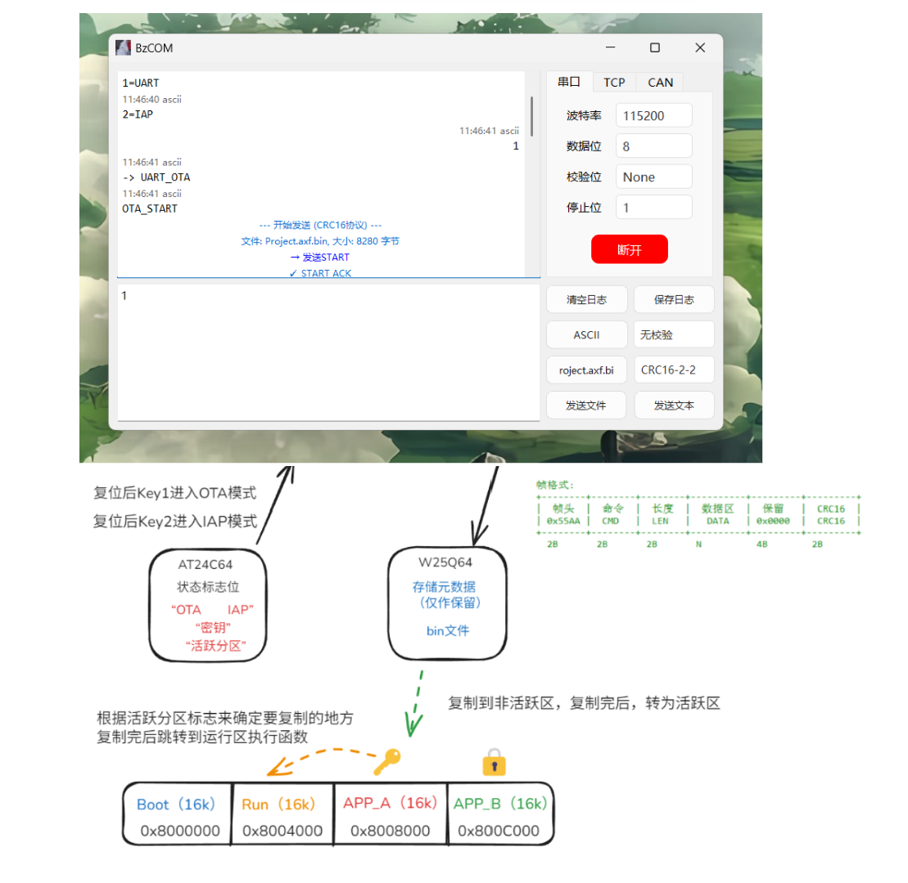
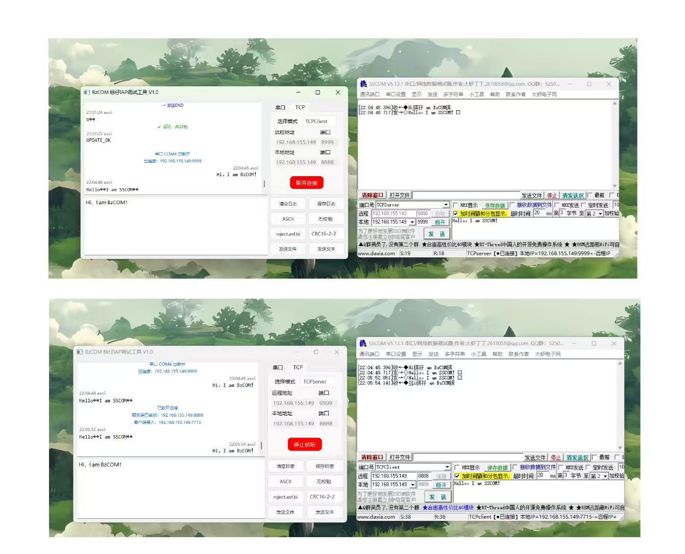

这是一个基于Qt开发，支持 **串口 + TCP + CAN** 的多功能 IAP/OTA 上位机工具，吸收了市面上串口调试工具的优点，主打简洁舒适的使用体验~

> 文件包中，有用野火F103小智做的Bootloader例程项目，下位机部分的教程，可以看尚硅谷的课程~
>
> **特别说明：**
> 通常的项目串口发送用的是单缓冲，但是因为F103的Flash只有1个Bank，写入数据的时候占用CPU，无法进入ISR，所以项目用了双缓冲的设计

Github：https://github.com/BiaoZai1214/BzCOM

百度云：https://pan.baidu.com/s/143V7Ot-IjoMvE1truXqNJQ?pwd=cz58

> 我会将本项目开源到我的 GitHub 仓库和一些博客网站，同时对所有非商业的个人和企业完全开放，可以进行修改和教学参考，但我希望你能够保留我的冠名 -- 标仔。针对非商业，这是因为我反对把别人的开源精神拿去牟私利的行为，也许我的文章没有任何商业价值，但是，特此声明一下。
>
> 一个人的能力是有限的，希望大家能够和我一起共建一个对初学者更友好的平台。

## 功能介绍

Tab标签支持3模切换，做了对串口和TCP做了OTA的支持，CAN的总线结构不太适合做OTA，所以仅保留了通讯功能，你需要一个外接一个PCAN的USB转CAN模块，就可以实现PC与单片机的CAN通讯。

## 升级流程

OTA是走的CRC16；IAP走的是无协议，STM32端按下KEY1发送数字选择 IAP / OTA 模式；按下KEY2 直接进入IAP模式

## TCP通信

